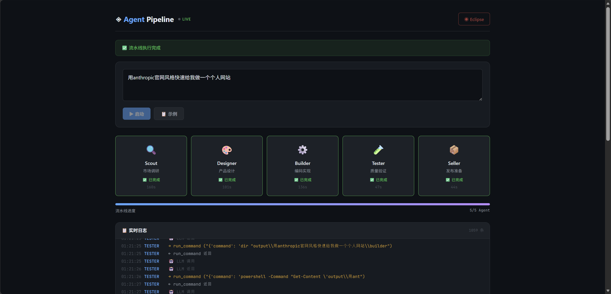

# Agent Pipeline

> **English** · [中文](README.zh.md)

**Five AI Agents cooperate automatically to turn your requirements into code, tests, and documentation.**

[]()
[]()
[]()

---

## What is Agent Pipeline?

Agent Pipeline is an **open-source development pipeline powered by five AI Agents**. You describe a product requirement — and the pipeline executes it end-to-end:

| # | Agent | Role | Output |
|---|-------|------|--------|
| 1 | **Scout** | Market research | `scout→designer--research-report.md` |
| 2 | **Designer** | Product design | `designer→builder--requirements.md` + `architecture.md` |
| 3 | **Builder** | Implementation | `builder→tester--src/` (code directory) |
| 4 | **Tester** | Quality verification | `tester→seller--test-report.md` |
| 5 | **Seller** | Release prep | `seller→user--README.md` |

**Key highlights:**

- **Five agents, fully automated** — one requirement triggers the entire chain
- **Tester→Builder feedback loop** — up to 3 automatic retry iterations when tests fail
- **Web UI with SSE real-time updates** — watch agents work live in your browser
- **Eclipse one-click shutdown** — cleanly terminate the server and release the port
- **Arrow-file naming** — each file documents its place in the pipeline (`producer→consumer--content.md`)
- **Pre-index gated RAG** — knowledge base hits load wiki pages directly without vector search

---

## Quick Start

### Path 1: Zero-config — see what's available (no API key needed)

See the command list and help:

```bash
# 1. Install
pip install -e .

# 2. Check it works
agent-pipeline --help
```

**Expected output:**

```
Usage: agent-pipeline [OPTIONS] COMMAND [ARGS]...

  Agent Pipeline — Five-Agent Development Pipeline.

  Enter a product requirement → five agents execute sequentially:
  Scout (Market Research) → Designer (Product Design) → Builder (Development) → Tester (Testing & QA) → Seller (Release Prep)

Options:
  --version  Show the version and exit.
  --help     Show this message and exit.

Commands:
  run     Launch the five-agent pipeline
  status  View pipeline status
  list    List historical pipeline records
  serve   Start the Web UI dashboard
```

No API key needed for `--help`. You can also browse the Web UI (see Path 3) to see the interface without a key.

---

### Path 2: Full pipeline run (with API key)

You need a **DeepSeek API key**. Get one free at [platform.deepseek.com](https://platform.deepseek.com).

```bash
# 1. Install
pip install -e .

# 2. Set your API key
export DEEPSEEK_API_KEY=sk-your-key-here

# 3. Run a pipeline
agent-pipeline run "Design a CLI TODO application"
```

**Expected output:**

```
🚀 Five-Agent Pipeline Started (ID: pl_20260610_143022_abc123)
📋 Requirement: Design a CLI TODO application
📁 Project: design-a-cli-todo-application

📊 Pipeline Board:
  🔍 Scout — Market Research      ⏳
  🎨 Designer — Product Design    ⏳
  ⚙️ Builder — Development        ⏳
  🧪 Tester — Testing & QA        ⏳
  📦 Seller — Release Prep        ⏳

✅ Five-Agent Pipeline Complete (total time: 123.4s)

📄 Artifacts:
  - output/design-a-cli-todo-application/scout→designer--research-report.md (12.3 KB)
  - output/design-a-cli-todo-application/designer→builder--requirements-analysis.md (5.1 KB)
  - output/design-a-cli-todo-application/designer→builder--architecture-design.md (6.2 KB)
  - output/design-a-cli-todo-application/builder→tester--src/ (directory)
  - output/design-a-cli-todo-application/tester→seller--test-report.md (3.4 KB)
  - output/design-a-cli-todo-application/seller→user--README.md (8.7 KB)
```

> **Note:** The first run may take a few minutes (Scout searches the web, Designer writes specs, Builder generates code, Tester reviews it, Seller writes the README). Each agent has a 5-minute timeout.

---

### Path 3: Web UI mode (with API key)

Prefer a graphical interface? Start the Web dashboard:

```bash
# 1. Set your API key
export DEEPSEEK_API_KEY=sk-your-key-here

# 2. Start the server
agent-pipeline serve
```

**Expected output:**

```
🌐 Agent Pipeline Web Service Started (http://localhost:3456)
Press Ctrl+C to stop the service
```

Open **http://localhost:3456** in your browser. You'll see:

1. A **text input** — type your requirement (e.g., "Design a CLI TODO application")
2. Click **▶ Start** — the five agent cards come alive one by one
3. **Real-time logs** — watch each agent's tool calls (searching, reading, writing) as they happen
4. **Progress bar** — see overall completion at a glance
5. **Artifacts** — click to download each output file
6. **◉ Eclipse** — gracefully shutdown the server


> *All five agents completed — Scout (62s) → Designer (103s) → Builder (97s) → Tester (126s) → Seller (71s)*

---

## Commands

### `agent-pipeline run`

Launch the five-agent pipeline.

```bash
agent-pipeline run [OPTIONS] REQUIREMENT
```

| Argument | Type | Required | Description |
|----------|------|:--------:|-------------|
| `REQUIREMENT` | string | Yes | Product requirement or problem description |

| Option | Type | Description |
|--------|------|-------------|
| `--resume` | flag | Resume from the last incomplete pipeline |

**Example:**

```bash
agent-pipeline run "Research the AI coding assistant market"
agent-pipeline run --resume
```

### `agent-pipeline status`

Check pipeline execution status.

```bash
agent-pipeline status [PIPELINE_ID]
```

| Argument | Type | Required | Description |
|----------|------|:--------:|-------------|
| `PIPELINE_ID` | string | No | Pipeline ID (defaults to the latest) |

**Expected output:**

```
Pipeline Status (pl_20260610_143022_abc123)
  Status: ✅ completed
  Requirement: Design a CLI TODO application
  Project: design-a-cli-todo-application
  Agent Execution:
    🔍 Scout: completed · Research report generated
    🎨 Designer: completed · Requirements & architecture generated
    ⚙️ Builder: completed · Code generated (iteration 0/3)
    🧪 Tester: completed · Test report generated
    📦 Seller: completed · README generated
```

### `agent-pipeline list`

List historical pipeline records.

```bash
agent-pipeline list [--limit N]
```

| Option | Default | Description |
|--------|:-------:|-------------|
| `--limit` | 20 | Show last N records |

### `agent-pipeline serve`

Start the Web UI dashboard.

```bash
agent-pipeline serve [--port PORT] [--no-open]
```

| Option | Default | Description |
|--------|:-------:|-------------|
| `--port` | 3456 | Web service port |
| `--no-open` | false | Don't auto-open the browser |

---

## Architecture

```
User Input (Requirement)
    │
    ▼
┌──────────────────────────────────────────────┐
│  LangGraph StateGraph (Orchestrator)          │
│                                               │
│  START → parse → scout → designer → builder  │
│                                        │      │
│                                        │      │
│  Tester ←──────────────────────────────┘      │
│    │                                          │
│    ├── (fix found, < 3 retries) → builder    │
│    └── (all passed or ≥ 3 retries) → seller  │
│                                              │
│  seller → finalize → END                     │
└──────────────────────────────────────────────┘
    │
    ▼
  Code + Tests + README
```

### How the Tester→Builder feedback loop works

1. **Tester** reviews Builder's code against Designer's specifications
2. If it finds issues, it writes `tester→builder--fix-instructions.md`
3. The **conditional edge** routes back to Builder (up to 3 times)
4. After 3 retries, or if all tests pass, it proceeds to Seller

### Pre-index gated RAG

Before executing agents, the Orchestrator:
1. Reads `wiki/index.md` to find relevant knowledge
2. **HIT** — loads matching wiki pages directly as context (no vector search needed)
3. **MISS** — proceeds with external search only

This is a design differentiator — "when *not* to use RAG."

---

## Environment Variables

| Variable | Required | Default | Description |
|----------|:--------:|---------|-------------|
| `DEEPSEEK_API_KEY` | Yes | — | DeepSeek API key (shared by all 5 agents) |
| `AGENT_PIPELINE_WIKI_PATH` | No | `../../wiki/` | Wiki root directory path |
| `AGENT_PIPELINE_DEBUG` | No | — | Show full exception tracebacks |

---

## Output Files

File names follow the convention `{producer}→{consumer}--{content}.md` — so you can always tell which agent produced it and who should read it.

| File | Producer | Consumer | Description |
|------|:--------:|:--------:|-------------|
| `scout→designer--research-report.md` | Scout | Designer | Market research report |
| `designer→builder--requirements-analysis.md` | Designer | Builder | JTBD + RICE + MVP requirements |
| `designer→builder--architecture-design.md` | Designer | Builder | Architecture & tech stack |
| `builder→tester--src/` | Builder | Tester | Generated code directory |
| `tester→seller--test-report.md` | Tester | Seller | Test results summary |
| `tester→builder--fix-instructions.md` | Tester | Builder | Fix instructions (only when bugs found) |
| `seller→user--README.md` | Seller | User | Generated README |

---

## FAQ

**Can I use it without an API key?**
You can run `--help` and `serve` (to see the UI), but any pipeline run requires a valid `DEEPSEEK_API_KEY`.

**How do I get a DeepSeek API key?**
Sign up at [platform.deepseek.com](https://platform.deepseek.com) — it's free to get started.

**What operating systems are supported?**
Windows, macOS, and Linux. Windows users are recommended to use WSL for the Web UI, but the CLI works natively.

**What if an agent fails?**
The pipeline shows a clear error card with the failure reason, and you can check the pipeline log for details. Common failures include API timeouts or the Builder not calling `write_code` correctly — both are surfaced with specific error messages.



> *Builder failed — the error message tells you exactly what went wrong: "Agent did not call write_code tool."*

**What if the pipeline breaks midway?**
Use `agent-pipeline run --resume` to resume from the last saved checkpoint. The pipeline saves `state.json` after every agent completes.

**The Web UI port is already in use?**
Specify a different port: `agent-pipeline serve --port 8888`

**How do I stop the Web server?**
Click the **◉ Eclipse** button in the top-right corner, or press `Ctrl+C` in the terminal.

**What programming languages does Builder generate?**
Builder generates Python code by default (matching the project's tech stack). It can generate any language the LLM supports.

**Can I customize the agents?**
This is planned for Phase 4. For now, you can modify the system prompts in `src/agent_pipeline/agents/`.

---

## Development

```bash
# Clone and install
git clone <repo-url>
cd agent-pipeline
pip install -e .

# Run tests
cd src
python -m pytest tests/test_cli.py -v

# Expected: 48 passed, 0 failed
```

---

## License

MIT
